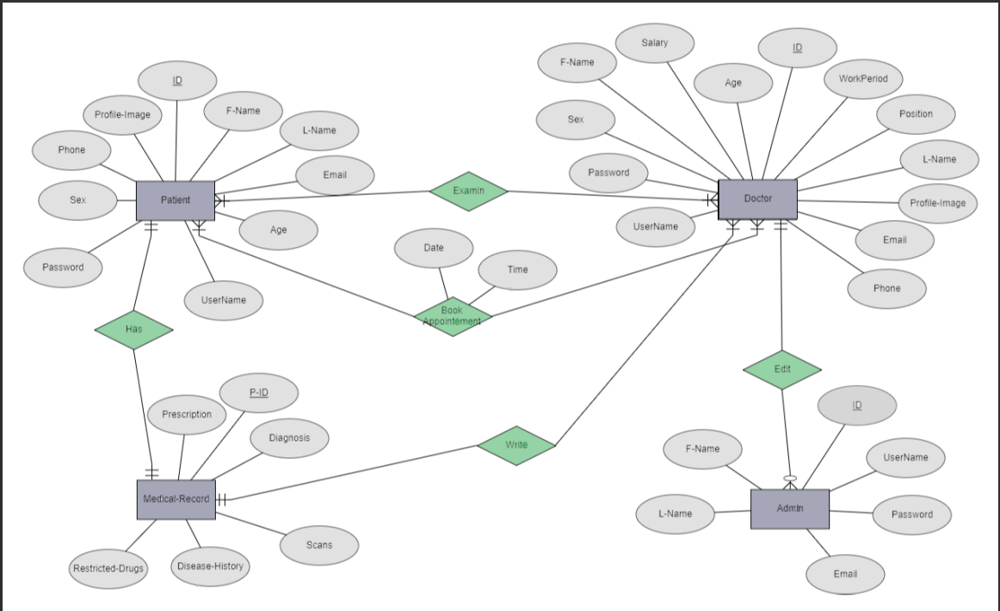

<center>  <h1> Hospital Information System </h1>
<h2>Cardiology Department</h2>
</center>

## Table of contents
* [Information](#information)
* [Technologies](#technologies)
* [Setup](#setup)
* [Sources](#sources)
* [Inspiration](#inspiration)
* [Launch](#launch)
* [Team](#team)

<hr>

## Information
- The project Front-end is made using pure HTML, CSS, & JS. <br>
- The project Back-end is made using Flask (Python) and SQLAlChemy (SQLite). <br>
> General Information
- This project is HIS for Cardiology Department for managing the reservations of patients with their doctors. and the admin has a higher access to:
  - See statistics and view all patients
  - See statistics and view / edit / add doctors
  - Add admins
- Any Patient can sign up to make an account to further make appointments with available doctors.<br>
- Patient or Doctor or Admin can sign in to open their profiles.
> 
<hr>

## Technologies
> Project Front-end is created with:
* HTML version: 5
* CSS version: 3
* JS version: ES6
> Project Back-end is created with:
* Flask version: 2.1.2
* Flask_Bcrypt version: 1.0.1
* Flask_Bootstrap version: 3.3.7.1
* Flask_Login version: 0.6.1
* Flask_SQLAlchemy version: 2.5.1
* Flask_WTF version: 1.0.1
* WTForms version: 3.0.1
* SQLAlChemy version: 1.4.0
* Gunicorn version: 20.1.0
<hr>

## Setup
To run this project, install it locally using pip:

```
$ cd ../"project_path"
$ pip install "required_modules"
$ py run app.py
```
<hr>

## Sources
* <a href="https://www.youtube.com/watch?v=Qr4QMBUPxWo&t=17510s"> Flask Crash Course </a>
* <a href="https://www.udemy.com/course/python-flask-beginners/">Flask Udemy Course</a> 
* <a href="https://docs.sqlalchemy.org/en/14/"> SQLAlChemy Documentation </a>
<hr>

## Inspiration
This app Front-end design is inspired by @fajarnurwahid - <a href="https://github.com/fajarnurwahid/adminhub.git"> Create Responsive Admin Dashboard </a>
<hr>

## Launch
<hr>

> <center><a href="https://github.com/mahmoud1yaser/HIS_Cardiology_FullStackWebsite.git">GitHub Repo</a></center>
<hr>

> <center><a href="https://his-cardiology.herokuapp.com/">Hosted Website</a></center>
> **Heroku free services are not available anymore that's why the app will not run globally**
<hr>

- > User Accounts to test the website:
  - > Username       | Password
    - > patientexample | 12345678
    - > doctorexample  | 12345678
    - > adminexample   | 12345678  

<hr>

## Team
- Mahmoud Salman (Back-end)
- Yousef Kadry (Backend)
- Maye Khaled (Frontend)
- Rawan Fekry (Frontend)
- Habiba Fathalla (Frontend)
- Mayar Ehab (Frontend)
<hr>
